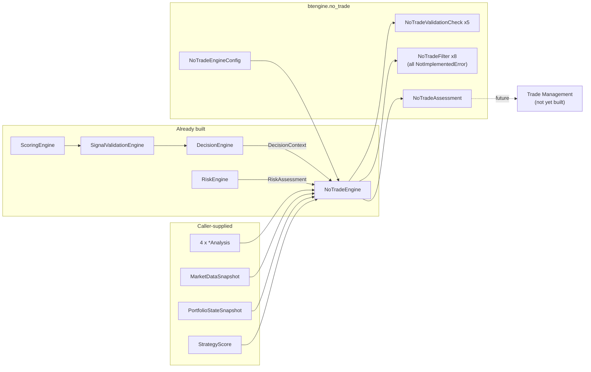

# No Trade Framework

Status: **Framework only. No no-trade rule, market-condition assumption,
strategy logic, or BUY/SELL signal has been implemented or assumed.**
This framework answers exactly one question — *is the system permitted
to trade at all right now?* — and, in this framework-only state, the
answer is always "no," explicitly and with reasons.

The defining property is **fail-safe gating**, mirroring the Risk
Management Framework's fail-safe approval:
`NoTradeAssessment.trading_allowed` is only ever `True` when input
validation found no errors, at least one filter actually ran, and
*every* filter that ran explicitly returned `FilterVerdict.ALLOW`. An
empty framework, an unimplemented filter (`CANNOT_EVALUATE`), an
explicit `BLOCK`, or any validation error all keep the gate closed —
and every closed gate carries explicit `blocked_reasons`, never a
silent refusal.

## 1. Folder structure

```
src/btengine/no_trade/
├── __init__.py
├── errors.py                NoTradeEngineError, NoTradeEngineConfigError
├── models.py                  FilterVerdict, FilterResult, NoTradeValidationIssue, NoTradeAssessment
├── config.py                    NoTradeEngineConfig, load_no_trade_engine_config()
├── context.py                     NoTradeRequest
├── filters/
│   ├── __init__.py
│   ├── base.py                     NoTradeFilter (ABC)
│   └── builtin.py                    8 named framework-only filters + default_filters()
├── checks/
│   ├── __init__.py
│   ├── base.py                       NoTradeValidationCheck (ABC)
│   └── builtin.py                      5 concrete, real validation checks + default_checks()
└── engine.py                             NoTradeEngine (the orchestrator)

tests/no_trade/       one test file per module above (+ conftest.py fixtures), 100% coverage
config/no_trade/
└── no_trade_engine.yaml    placeholder template (mirrors every prior config template's convention)
```

Nothing outside `btengine.no_trade` was modified. The package reuses
`btengine.risk.models.PortfolioStateSnapshot`/`MarketDataSnapshot`/
`RiskAssessment` as inputs — the risk framework already defined exactly
the decoupled portfolio/market shapes this task's INPUT section names,
so re-defining them would be duplication, not layer isolation.

## 2. Input

```python
def evaluate(
    self, symbol: str, reference_time: datetime, *,
    decision_context: DecisionContext,
    score: StrategyScore,
    risk_assessment: RiskAssessment | None = None,
    funding: FundingAnalysis | None = None,
    open_interest: OpenInterestAnalysis | None = None,
    premium_discount: PremiumDiscountAnalysis | None = None,
    liquidity: LiquidityAnalysis | None = None,
    market_data: MarketDataSnapshot | None = None,
    portfolio: PortfolioStateSnapshot | None = None,
) -> NoTradeAssessment
```

All ten named inputs from the task's INPUT section: `decision_context`
and `score` required; everything else optional (a missing optional
input is a `WARNING`, and any future filter that needs it returns
`CANNOT_EVALUATE`, which already keeps the gate closed). `Configuration`
arrives via the constructor-injected `NoTradeEngineConfig`.
`reference_time` is caller-supplied — the engine never reads the wall
clock, which is precisely what will let the future Time/Session filters
run identically inside a backtest.

## 3. Interfaces (Python classes)

### `NoTradeFilter` (`filters/base.py`)

```python
class NoTradeFilter(ABC):
    @property
    @abstractmethod
    def filter_name(self) -> str: ...
    @property
    @abstractmethod
    def filter_version(self) -> str: ...
    @abstractmethod
    def evaluate(self, request: NoTradeRequest) -> FilterResult: ...
```

"Multiple independent filters": one gating question per filter,
individually versioned, individually enable/disable-able via
`NoTradeEngineConfig.enabled_filters`, injected via the engine's
`filters=[...]` constructor argument. `FilterVerdict` is deliberately
**tri-state** (`ALLOW`/`BLOCK`/`CANNOT_EVALUATE`), mirroring the Risk
framework's tri-state `approved` — an unimplemented filter can never be
confused with an allowing one.

### The eight named framework-only filters (`filters/builtin.py`)

| Filter | Future input read |
|---|---|
| `MarketConditionFilter` | the four analyses vs. owner-supplied market-condition rules |
| `RiskFilter` | `NoTradeRequest.risk_assessment` (e.g. block when risk not approved) |
| `StrategyFilter` | `score`/`decision_context` vs. owner-supplied strategy-state rules |
| `PortfolioFilter` | `NoTradeRequest.portfolio` vs. owner-supplied portfolio rules |
| `DataQualityFilter` | upstream validation statuses vs. an owner-supplied quality bar |
| `TimeFilter` | `reference_time` vs. owner-supplied time windows (`filter_parameters`) |
| `SessionFilter` | `reference_time` vs. owner-supplied session definitions (complements the existing declarative `strategy/rules/session_filters.py` RuleSet, likewise content-free) |
| `ExchangeFilter` | exchange identity/state vs. an owner-supplied allowlist (`filter_parameters`) |

Every `evaluate()` raises `NotImplementedError` via one deliberately
centralized stub base, so no stub can diverge into inventing a rule.
The two "Future" responsibilities — **News/Event Filter** and **AI
Validation Filter** — are documented in §8 rather than stubbed: their
inputs (a news/economic-calendar feed; a concrete AI integration) don't
exist in this codebase yet.

### `NoTradeValidationCheck` (`checks/base.py`) + five real checks

Checks validate inputs and *filter registration itself* — never a
gating rule. `run()` receives the as-registered filter-name list so
registration problems are checkable:

| Check | Task responsibility | Definition |
|---|---|---|
| `MissingFilterInputsCheck` | Missing filter inputs | Any absent optional input — `WARNING` |
| `InvalidDataCheck` | Invalid data | Empty/naive score fields, invalid analysis confidence, non-positive market price, NaN portfolio equity — `ERROR` (defense-in-depth re-validation at this final pre-trade stage) |
| `ConflictingFiltersCheck` | Conflicting filters | An `enabled_filters` entry naming no registered filter — configuration and registration disagree — `ERROR` |
| `DuplicateFiltersCheck` | Duplicate filters | Two registered filters sharing one `filter_name` (the configuration key) — `ERROR` |
| `StrategyVersionMismatchCheck` | Strategy version mismatch | `DecisionContext.strategy_version` vs. configured expectation, vs. `StrategyScore.score_version`, and vs. `RiskAssessment.strategy_version` — `WARNING` |

### `NoTradeEngine` (`engine.py`)

Dependency-injected orchestrator (`filters=[...]`, `checks=[...]`).
Validation errors short-circuit: filters never run on invalid input.
`enabled_filters` restricts which registered filters run; skipped
filters are recorded in `metadata["skipped_filters"]`, never silently
dropped.

## 4. `NoTradeAssessment` — the output object

```python
@dataclass(frozen=True)
class NoTradeAssessment:
    symbol: str
    as_of: datetime
    strategy_version: str
    timestamp: datetime

    trading_allowed: bool                    # fail-safe: see top of this document
    blocked_reasons: tuple[str, ...]           # explicit reason for every closed gate
    warning_messages: tuple[str, ...]
    active_filters: tuple[str, ...]

    validation_status: ValidationStatus          # reused from btengine.scoring.models
    filter_results: tuple[FilterResult, ...] = ()
    errors: tuple[NoTradeValidationIssue, ...] = ()
    warnings: tuple[NoTradeValidationIssue, ...] = ()
    metadata: dict[str, object] = {}
```

## 5. Fail-safe gating semantics (summary table)

| Condition | `trading_allowed` | `blocked_reasons` contains |
|---|---|---|
| Any validation `ERROR` | `False` (filters never run) | "validation failed with N error(s)" |
| Zero filters registered/enabled | `False` | "no active no-trade filters ..." |
| Any filter returns `CANNOT_EVALUATE` | `False` | "<filter>: could not evaluate (...)" |
| Any filter returns `BLOCK` | `False` | "<filter>: <its reason>" |
| ≥ 1 filter ran and **all** returned `ALLOW` | `True` | (empty) |

Warnings alone (missing optional inputs, version-mismatch warnings)
never close the gate — but with the framework-only filters shipped
here, the gate is closed regardless, since every filter reports
`CANNOT_EVALUATE`. Asserted directly in tests.

## 6. Configuration

```python
@dataclass(frozen=True)
class NoTradeEngineConfig:
    engine_version: str                                  # required, no default
    enabled_filters: tuple[str, ...] | None = None         # None = all registered filters run
    expected_strategy_version: str | None = None
    filter_parameters: dict[str, dict[str, object]] = {}     # free-form, per future filter
```

"Configurable filters" = `enabled_filters` + per-filter
`filter_parameters` (this framework defines no keys; each future filter
documents and reads its own — e.g. blocked sessions, time windows,
exchange allowlists). "Strategy versions" = `engine_version` +
`expected_strategy_version`, matching every prior engine.
`load_no_trade_engine_config(path)` loads
`config/no_trade/no_trade_engine.yaml` under the project's established
loader convention.

## 7. Integration flow



`NoTradeEngine` never reaches upstream past its given inputs — it does
not call any other engine, CoinGlass, or any data source directly.

## 8. Future extension points

- **News/Event Filter** — needs a news/economic-calendar data source
  with no canonical schema yet; once one exists, it's one more
  `NoTradeFilter` (reading the new feed via a new optional
  `NoTradeRequest` field — an additive change, since every current
  input is already optional) registered via the `filters` list.
- **AI Validation Filter** — a `NoTradeFilter` whose `evaluate()` wraps
  `btengine.integrations.ai_model.AIModelProvider` (already built), the
  same AI seam every prior engine documents.
- **Multi-timeframe filters** — a filter reading
  `PremiumDiscountAnalysis.timeframe` (already carried) or the caller
  running `evaluate()` once per timeframe, mirroring the established
  `timeframe_label` pattern.
- **Portfolio-level filters** — `PortfolioFilter` is the named seam;
  `evaluate()` is symbol-scoped and stateless across calls, so a
  higher-level loop over symbols (with `PortfolioStateSnapshot.positions`
  already carrying every open symbol) needs no engine change.

## 9. What this framework explicitly does not do

- No no-trade rules of any kind — no market-condition, time, session,
  or exchange assumption.
- No BUY/SELL signal generation; the only question answered is whether
  trading is permitted at all.
- Never opens the gate by default — see §5.
- No GUI.

Waiting for approval before implementing the Trade Management Framework.
