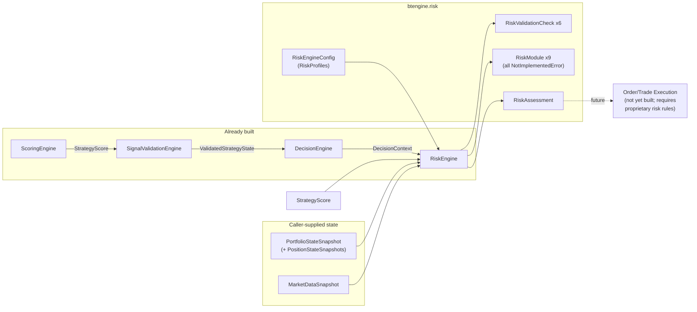

# Risk Management Framework

Status: **Framework only. No risk rule, position sizing formula,
leverage rule, stop loss rule, take profit rule, or trading signal has
been implemented or assumed.** This is part of the proprietary trading
system per the task that requested it — every place a real risk formula
would go is either an abstract seam, a `NotImplementedError` stub, or a
`None`-defaulted configuration placeholder.

The framework's defining property is **fail-safe semantics**:
`RiskAssessment.risk_approved` is only ever `True` when input validation
found no errors, at least one risk module is registered, *and every
registered module explicitly approved*. An empty framework, an
unimplemented module ("could not evaluate," `approved=None`), or any
validation error all resolve to `risk_approved=False`. An unimplemented
risk system never fails open.

## 1. Folder structure

```
src/btengine/risk/
├── __init__.py
├── errors.py                RiskEngineError, RiskEngineConfigError
├── models.py                  PositionStateSnapshot, PortfolioStateSnapshot, MarketDataSnapshot,
│                                ExposureStatus, RiskValidationIssue, RiskModuleResult, RiskAssessment
├── config.py                    RiskProfile, RiskEngineConfig, load_risk_engine_config()
├── context.py                     RiskRequest
├── modules/
│   ├── __init__.py
│   ├── base.py                     RiskModule (ABC)
│   └── builtin.py                    9 named framework-only modules + default_modules()
├── checks/
│   ├── __init__.py
│   ├── base.py                       RiskValidationCheck (ABC)
│   └── builtin.py                      6 concrete, real input-validation checks + default_checks()
└── engine.py                             RiskEngine (the orchestrator)

tests/risk/           one test file per module above (+ conftest.py fixtures), 100% coverage
config/risk/
└── risk_engine.yaml     placeholder template (mirrors every prior config template's convention)
```

Nothing outside `btengine.risk` was modified. `btengine.risk` sits one
layer above `btengine.decision` — the same correct-layering dependency
chain `scoring → signal_validation → decision` already established.

## 2. Input

```python
def assess(
    self, symbol: str, reference_time: datetime, *,
    decision_context: DecisionContext,
    score: StrategyScore,
    portfolio: PortfolioStateSnapshot,
    market_data: MarketDataSnapshot | None = None,
) -> RiskAssessment
```

This maps the task's six named inputs: `DecisionContext` and
`StrategyScore` directly; `PortfolioState`/`PositionState` as this
framework's own frozen `PortfolioStateSnapshot`/`PositionStateSnapshot`
types — deliberately decoupled from the live, mutable
`btengine.backtest.portfolio_state.PortfolioState` /
`position_manager.Position` classes (simulation bookkeeping, not
validated inputs), so the engine works identically across backtesting,
demo trading, and live trading, and so its validator can catch
malformed values; `MarketData` as `MarketDataSnapshot` (a price to
value positions with, plus an optional `volatility` hook for the future
Volatility Risk module); and `Configuration` via the constructor-injected
`RiskEngineConfig`. `reference_time` is caller-supplied — the engine
never reads the wall clock.

## 3. Interfaces (Python classes)

### `RiskModule` (`modules/base.py`)

```python
class RiskModule(ABC):
    @property
    @abstractmethod
    def module_name(self) -> str: ...
    @property
    @abstractmethod
    def module_version(self) -> str: ...
    @abstractmethod
    def evaluate(self, request: RiskRequest) -> RiskModuleResult: ...
```

One independent module per named responsibility — implemented,
versioned, tested, and replaced separately via dependency injection.
`RiskModuleResult.approved` is deliberately **tri-state**:
`True` (explicit approval), `False` (explicit rejection), `None`
("could not evaluate" — the permanent state of every stub shipped
here). The distinction is what makes fail-safe semantics possible: an
unimplemented module can never be confused with an approving one.

### The nine named framework-only modules (`modules/builtin.py`)

| Module | Future output field | Future limit evaluated |
|---|---|---|
| `PositionSizingModule` | `RiskAssessment.position_size` | `max_risk_per_trade_pct` + owner's sizing formula |
| `LeverageValidationModule` | `RiskAssessment.leverage_allowed` | `max_leverage` |
| `MaxRiskValidationModule` | `RiskAssessment.max_risk_allowed` | `max_risk_per_trade_pct` |
| `DailyDrawdownProtectionModule` | — | `max_daily_drawdown_pct` vs. `daily_realized_pnl` |
| `TotalDrawdownProtectionModule` | — | `max_total_drawdown_pct` vs. equity/`peak_equity` |
| `ExposureManagementModule` | `RiskAssessment.exposure_status` | `max_exposure_pct` |
| `CapitalAllocationModule` | — | `max_capital_allocation_pct` |
| `MarginValidationModule` | — | `max_margin_utilization_pct` vs. `margin_used` |
| `PortfolioRiskModule` | `RiskAssessment.portfolio_risk` | `max_portfolio_risk_pct` |

Every `evaluate()` raises `NotImplementedError` — the formulas are
proprietary. The two "(future)" responsibilities — **Correlation Risk**
and **Volatility Risk** — are documented in §8 rather than stubbed:
their required inputs (correlation matrices; an agreed volatility
measure) don't exist in this codebase yet.

### `RiskValidationCheck` (`checks/base.py`) + six real checks

Checks validate *inputs*, never risk *rules*. E.g. "invalid leverage"
means a position reporting a structurally impossible leverage value
(NaN, ≤ 0) — never "leverage is too high for the strategy" (that's the
unimplemented `LeverageValidationModule`'s future job, against an
owner-supplied limit).

| Check | Task responsibility | Definition |
|---|---|---|
| `InvalidLeverageCheck` | Invalid leverage | NaN/infinite/non-positive `PositionStateSnapshot.leverage` — `ERROR` |
| `InvalidPortfolioStateCheck` | Invalid portfolio state | NaN/infinite cash/equity; NaN quantity/entry price or negative entry price on a position — `ERROR` |
| `InvalidAccountBalanceCheck` | Invalid account balance | Equity ≤ 0 (nothing can be risked from an empty account, whatever the rules say) — `ERROR` |
| `InvalidExposureCheck` | Invalid exposure | NaN unrealized PnL; market data with a non-positive price — `ERROR` |
| `MissingConfigurationCheck` | Missing configuration | No active risk profile, or unset limits on the active one — `WARNING` (expected until the owner fills them in; fail-safe approval already guarantees no silent pass) |
| `StrategyVersionMismatchCheck` | Strategy version mismatch | `DecisionContext.strategy_version` vs. configured `expected_strategy_version`, and vs. `StrategyScore.score_version` — `WARNING` |

### `RiskEngine` (`engine.py`)

Dependency-injected orchestrator (`modules=[...]`, `checks=[...]`,
defaulting to no modules and `default_checks()`). Validation errors
short-circuit: modules never run on structurally invalid input. Module
values map to `RiskAssessment` fields by module name
(`position_sizing → position_size`, etc.); `exposure_management`'s
tri-state result maps to `ExposureStatus`
(`WITHIN_LIMITS`/`EXCEEDED`/`UNKNOWN`).

## 4. `RiskAssessment` — the output object

```python
@dataclass(frozen=True)
class RiskAssessment:
    symbol: str
    as_of: datetime
    strategy_version: str
    timestamp: datetime

    risk_approved: bool                       # fail-safe: see top of this document
    position_size: float | None                # None until PositionSizingModule is implemented
    leverage_allowed: float | None               # None until LeverageValidationModule is implemented
    max_risk_allowed: float | None                 # None until MaxRiskValidationModule is implemented
    exposure_status: ExposureStatus                  # UNKNOWN until ExposureManagementModule is implemented
    portfolio_risk: float | None                       # None until PortfolioRiskModule is implemented

    validation_status: ValidationStatus                  # reused from btengine.scoring.models
    module_results: tuple[RiskModuleResult, ...] = ()
    errors: tuple[RiskValidationIssue, ...] = ()
    warnings: tuple[RiskValidationIssue, ...] = ()
    metadata: dict[str, object] = {}
```

With the framework-only modules shipped here, every numeric field stays
`None`, `exposure_status` stays `UNKNOWN`, and `risk_approved` stays
`False` — asserted directly in tests.

## 5. Configuration: Risk Profiles

```python
@dataclass(frozen=True)
class RiskProfile:
    name: str
    max_leverage: float | None = None
    max_risk_per_trade_pct: float | None = None
    max_daily_drawdown_pct: float | None = None
    max_total_drawdown_pct: float | None = None
    max_exposure_pct: float | None = None
    max_capital_allocation_pct: float | None = None
    max_margin_utilization_pct: float | None = None
    max_portfolio_risk_pct: float | None = None

@dataclass(frozen=True)
class RiskEngineConfig:
    engine_version: str                          # required, no default
    profiles: dict[str, RiskProfile] = {}
    active_profile: str | None = None
    expected_strategy_version: str | None = None
```

"Risk Profiles" per the task's CONFIGURATION section: named
`RiskProfile` instances (e.g. a future "conservative" and "aggressive"),
with `active_profile` selecting which applies — switchable per engine
instance without code changes. Every limit defaults to `None`; the
`*_pct` naming is a unit convention (fraction of equity) only.
"Strategy Versions" are covered by `engine_version` (required, matching
every prior engine) plus `expected_strategy_version`.
`load_risk_engine_config(path)` loads `config/risk/risk_engine.yaml`
under the project's established "missing key is a placeholder" loader
convention.

## 6. Integration flow



`RiskEngine` never reaches upstream past its given inputs — it does not
call the Decision Engine, CoinGlass, or any data source directly.

## 7. Fail-safe approval semantics (summary table)

| Condition | `risk_approved` |
|---|---|
| Any validation `ERROR` | `False` (modules never even run) |
| Zero modules registered | `False` |
| Any module returns `approved=None` (unimplemented) | `False` |
| Any module returns `approved=False` (explicit rejection) | `False` |
| ≥ 1 module registered and **all** return `approved=True` | `True` |

## 8. Future extension points

- **Correlation Risk** — needs cross-asset correlation input that has
  no canonical schema yet; once it exists, it's one more `RiskModule`
  (e.g. `CorrelationRiskModule`) registered via the `modules` list — no
  engine change.
- **Volatility Risk** — `MarketDataSnapshot.volatility` is already the
  input hook; a future `VolatilityRiskModule` reads it against an
  owner-supplied limit added to `RiskProfile`.
- **Future AI Risk Models** — a `RiskModule` whose `evaluate()` wraps
  `btengine.integrations.ai_model.AIModelProvider` (already built), the
  same seam the Scoring/Decision engines document for their own AI
  extension points.
- **Portfolio Risk Models** — `PortfolioRiskModule` is the named seam;
  a richer model is just its implementation (or a sibling module).
- **Multi-Asset Risk** — `assess()` is symbol-scoped and stateless
  across calls; `PortfolioStateSnapshot.positions` already carries every
  open symbol, so a future `MultiAssetRiskModule` (or a higher-level
  loop over symbols) has everything it needs today.

## 9. What this framework explicitly does not do

- No risk rules, position sizing, leverage, stop loss, or take profit
  logic of any kind.
- No BUY/SELL signal generation.
- Never approves risk by default — see §7.
- No GUI.

Waiting for approval before implementing the No Trade Framework.
