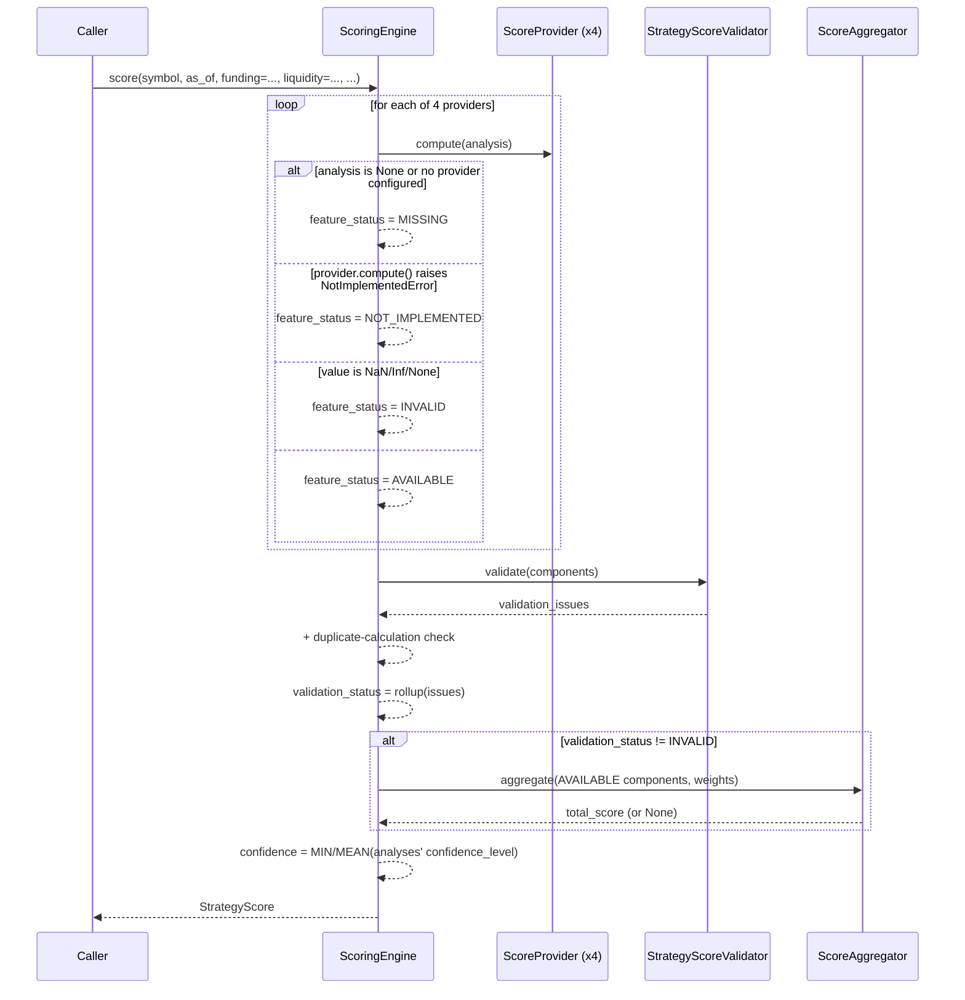

# Proprietary Scoring Engine Framework

Status: **Framework only. No scoring logic, weight, threshold, or
BUY/SELL signal has been implemented or assumed.** This is explicitly
"the core of the proprietary strategy" per the task that requested it —
every place a real formula, weight, or threshold would go is either an
abstract method that raises `NotImplementedError` or a configuration
field that defaults to `None`. What this framework *does* provide is
production-grade: the orchestration, validation, aggregation
mechanics, and extension points a real scoring implementation will plug
into.

## 1. Folder structure

```
src/btengine/scoring/
├── __init__.py
├── errors.py                    ScoringError, ScoringConfigError
├── models.py                     FeatureStatus, ValidationStatus, ScoreComponent,
│                                   StrategyScoreValidationIssue, StrategyScore
├── config.py                      ScoreWeights, ScorePriorities, ConfidenceAggregationMethod,
│                                    ScoringEngineConfig, order_providers_by_priority(),
│                                    weights_from_scoring_model_config(), load_scoring_engine_config()
├── providers/
│   ├── __init__.py
│   ├── base.py                    ScoreProvider (ABC, generic interface)
│   ├── funding.py                   FundingScoreProvider        — framework only
│   ├── open_interest.py              OpenInterestScoreProvider   — framework only
│   ├── premium_discount.py            PremiumDiscountScoreProvider — framework only
│   └── liquidity.py                    LiquidityScoreProvider       — framework only
├── aggregation.py                  ScoreAggregator (ABC) + WeightedSumAggregator (generic, real)
├── validation.py                    StrategyScoreValidator
└── engine.py                         ScoringEngine (the orchestrator)

tests/scoring/         one test file per module above, 100% coverage
config/scoring/
└── scoring_engine.yaml   placeholder template (mirrors config/strategy/scoring.yaml's convention)
```

Nothing in `btengine.strategy`, `btengine.features`, `btengine.data`,
`btengine.backtest`, or any `btengine.analysis.*` package was modified.
`btengine.scoring` is the first package in this project that
*intentionally* depends on multiple analysis modules at once — that's
correct layering (it sits above the four analyzers, consuming their
already-standardized output), not a violation of the analyzers'
deliberate isolation from each other.

## 2. Interfaces (Python classes)

### `ScoreProvider[TAnalysis]` (`providers/base.py`)

```python
class ScoreProvider(ABC, Generic[TAnalysis]):
    @property
    @abstractmethod
    def provider_name(self) -> str: ...
    @property
    @abstractmethod
    def provider_version(self) -> str: ...
    @abstractmethod
    def compute(self, analysis: TAnalysis) -> ScoreComponent: ...
```

"Independent Score Providers": one provider per analyzer, generic over
its specific analysis type (`ScoreProvider[FundingAnalysis]`, etc.) for
Interface Segregation — a provider never sees another provider's output
and never aggregates. All four concrete providers shipped
(`FundingScoreProvider`, `OpenInterestScoreProvider`,
`PremiumDiscountScoreProvider`, `LiquidityScoreProvider`) raise
`NotImplementedError` from `compute()`:

```python
class FundingScoreProvider(ScoreProvider[FundingAnalysis]):
    def __init__(self, *, version: str = "unversioned") -> None: ...
    @property
    def provider_name(self) -> str: return "funding"
    @property
    def provider_version(self) -> str: return self._version
    def compute(self, analysis: FundingAnalysis) -> ScoreComponent:
        raise NotImplementedError(...)
```

### `ScoreAggregator` (`aggregation.py`)

```python
class ScoreAggregator(ABC):
    @abstractmethod
    def aggregate(
        self, components: Mapping[str, ScoreComponent | None], weights: ScoreWeights
    ) -> float | None: ...
```

"Dynamic Score Aggregation": pluggable via dependency injection into
`ScoringEngine`. One concrete implementation ships:
`WeightedSumAggregator` computes `sum(weight_i * value_i) /
sum(weight_i)` over whatever components it's given — a generic
mathematical operation (the same category as the z-score/regression
helpers used throughout the analysis modules), not a trading rule. It
refuses to produce a number (`None`) if any given component lacks a
configured weight or value, rather than defaulting a missing weight to
zero or an equal share.

### `StrategyScoreValidator` (`validation.py`)

Stateless; inspects one snapshot of components — see §5.

### `ScoringEngine` (`engine.py`)

The orchestrator. Every collaborator — four providers, an aggregator, a
validator — is supplied through the constructor:

```python
class ScoringEngine:
    def __init__(
        self, config: ScoringEngineConfig, *,
        funding_provider: ScoreProvider[FundingAnalysis] | None = None,
        open_interest_provider: ScoreProvider[OpenInterestAnalysis] | None = None,
        premium_discount_provider: ScoreProvider[PremiumDiscountAnalysis] | None = None,
        liquidity_provider: ScoreProvider[LiquidityAnalysis] | None = None,
        aggregator: ScoreAggregator | None = None,
        validator: StrategyScoreValidator | None = None,
    ) -> None: ...

    def score(
        self, symbol: str, as_of: datetime, *,
        funding: FundingAnalysis | None = None,
        open_interest: OpenInterestAnalysis | None = None,
        premium_discount: PremiumDiscountAnalysis | None = None,
        liquidity: LiquidityAnalysis | None = None,
    ) -> StrategyScore: ...
```

This is Dependency Injection / Dependency Inversion in the SOLID sense:
`ScoringEngine` depends only on the `ScoreProvider`/`ScoreAggregator`
abstractions, never on a concrete formula, so a real provider or a
future AI/ML aggregator substitutes in without touching this class.
**It never calls CoinGlass, the Feature Store, or any other data source
— it only accepts already-computed analysis objects**, per this task's
explicit constraint.

## 3. `StrategyScore` — the output object

```python
@dataclass(frozen=True)
class StrategyScore:
    symbol: str
    as_of: datetime
    score_version: str

    funding_score: ScoreComponent | None
    oi_score: ScoreComponent | None
    premium_discount_score: ScoreComponent | None
    liquidity_score: ScoreComponent | None

    total_score: float | None
    confidence: float | None

    feature_status: dict[str, FeatureStatus]
    validation_status: ValidationStatus
    validation_issues: tuple[StrategyScoreValidationIssue, ...]
```

Every `*_score` field is a `ScoreComponent | None`, not a bare number —
this is what makes the framework "Explainable Scoring": each component
carries its own `provider_name`, `provider_version`, `value`, `weight`,
`confidence`, and free-text `explanation`, so a caller can always see
*which* provider produced *what*, under *which* version, with *what*
underlying confidence — not just a final number. `total_score` and
`confidence` are `None` whenever they can't be honestly computed (a
missing weight, a validation `ERROR`) rather than a partial or
default value.

`feature_status: dict[str, FeatureStatus]` — one of `AVAILABLE`,
`MISSING` (analysis wasn't given, or no provider is configured for it),
`NOT_IMPLEMENTED` (a provider exists but its formula doesn't yet — true
for every shipped provider), or `INVALID` (the provider ran but produced
a NaN/infinite/out-of-range value) — answers "Missing feature inputs"
and "Feature Confidence" precisely, per input.

## 4. `ScoringEngineConfig` — configuration

```python
@dataclass(frozen=True)
class ScoringEngineConfig:
    engine_version: str                                    # required, no default

    weights: ScoreWeights = ScoreWeights()                  # every field None by default
    priorities: ScorePriorities = ScorePriorities()          # every field None by default
    required_providers: tuple[str, ...] | None = None
    score_min: float = 0.0
    score_max: float = 1.0
    confidence_aggregation: ConfidenceAggregationMethod = ConfidenceAggregationMethod.MIN
```

- **Configurable weights** — `ScoreWeights` (one `float | None` per
  provider, all `None` by default). `WeightedSumAggregator` refuses to
  produce `total_score` for any available component lacking one.
- **Configurable thresholds** — `score_min`/`score_max` are the
  framework's own structural scale (like `confidence_level`'s
  established 0–1 convention throughout this project), not a strategy
  threshold; the real business thresholds (what score means "enter,"
  "exit," ...) belong to the not-yet-built Decision Engine, explicitly
  out of scope here.
- **Rule Priorities** — `ScorePriorities` (one `int | None` per
  provider) plus `order_providers_by_priority()`, a pure ordering
  utility. This framework only orders providers deterministically by
  priority; it does not invent what a priority *does* beyond that (e.g.
  it never lets a higher-priority provider override a lower one's
  value — that would be a scoring rule).
- **Multiple strategy versions** — `engine_version` is required (no
  default), exactly like `btengine.strategy.scoring.config.ScoringModelConfig.version`
  already requires at the declarative spec layer. Two `ScoringEngine`
  instances built from two different `ScoringEngineConfig`s (different
  `engine_version`s, different weights) can run side by side — see §8.
- **Future AI scoring models / Future ML integration** — see §9.

`weights_from_scoring_model_config()` bridges this engine's config to
the *already-built* declarative `btengine.strategy.scoring.config.ScoringModelConfig`
(from the Strategy Specification Framework phase): it reads each
enabled `ScoringFactorConfig.weight` whose `source_rule_set` matches a
known provider name and produces a `ScoreWeights`. This lets a strategy
owner fill in weights once, in `config/strategy/scoring.yaml`, and drive
this engine from it — or configure `ScoreWeights` directly, standalone.

`load_scoring_engine_config(path)` loads this engine's own
`config/scoring/scoring_engine.yaml` — see that file for the
placeholder template.

## 5. Validation

`StrategyScoreValidator.validate(components)` checks exactly the five
things this task's VALIDATION section names:

| Check | Severity | Definition |
|---|---|---|
| Missing modules | `ERROR` | A provider named in `required_providers` has no component (`components[name] is None`) |
| Missing feature inputs | `WARNING` | An available component's `confidence == 0.0` — the upstream analyzer had no usable historical data, even though it returned an object |
| Invalid scores | `ERROR` | A component's `value` is NaN/infinite, or falls outside `[score_min, score_max]` |
| Version mismatch | `WARNING` | A component's `provider_version` doesn't match `config.engine_version` |
| Duplicate calculations | `WARNING` | The same `(symbol, as_of, engine_version)` was already scored by this `ScoringEngine` instance |

"Duplicate calculations" is the one check requiring state across calls,
so it lives on `ScoringEngine` itself (a `set` of previously-seen
`(symbol, as_of, engine_version)` keys) rather than the stateless
validator, which only ever inspects one snapshot in isolation.

`StrategyScore.validation_status` rolls every issue up: `INVALID` if any
`ERROR` is present, else `WARNING` if anything at all was flagged, else
`VALID`. `total_score` is withheld (`None`) whenever `validation_status`
is `INVALID`.

## 6. Integration diagram

```mermaid
flowchart LR
    subgraph Analyzers["Analysis Modules (already built)"]
        FA[FundingAnalysis]
        OA[OpenInterestAnalysis]
        PA[PremiumDiscountAnalysis]
        LA[LiquidityAnalysis]
    end

    subgraph Scoring["btengine.scoring"]
        FP[FundingScoreProvider]
        OP[OpenInterestScoreProvider]
        PP[PremiumDiscountScoreProvider]
        LP[LiquidityScoreProvider]
        AGG[ScoreAggregator]
        VAL[StrategyScoreValidator]
        ENG[ScoringEngine]
        OUT[StrategyScore]
    end

    subgraph Config["Configuration"]
        CFG[ScoringEngineConfig]
        SPEC["strategy/scoring.yaml\n(ScoringModelConfig)"]
    end

    FA --> FP
    OA --> OP
    PA --> PP
    LA --> LP

    FP --> ENG
    OP --> ENG
    PP --> ENG
    LP --> ENG

    CFG --> ENG
    SPEC -. weights_from_scoring_model_config .-> CFG

    ENG --> AGG
    ENG --> VAL
    ENG --> OUT

    OUT -.future.-> DEC[Decision Engine\n(not yet built)]
```

`ScoringEngine` never reaches upstream past the four `*Analysis`
objects — it does not call CoinGlass, the Data Layer, or the Feature
Store. The Decision Engine consuming `StrategyScore` is the explicit
next phase, out of scope here.

## 7. Score flow diagram



## 8. Multiple strategy versions, side by side

```python
config_v1 = ScoringEngineConfig(engine_version="1.0.0", weights=ScoreWeights(funding=0.6, liquidity=0.4))
config_v2 = ScoringEngineConfig(engine_version="2.0.0", weights=ScoreWeights(funding=0.5, liquidity=0.5))

engine_v1 = ScoringEngine(config_v1, funding_provider=..., liquidity_provider=...)
engine_v2 = ScoringEngine(config_v2, funding_provider=..., liquidity_provider=...)

score_v1 = engine_v1.score("BTCUSDT", now, funding=funding, liquidity=liquidity)
score_v2 = engine_v2.score("BTCUSDT", now, funding=funding, liquidity=liquidity)
```

Each `StrategyScore.score_version` records exactly which engine produced
it. `btengine.strategy.versioning.StrategyRegistry` (built in the
Strategy Plugin Framework phase) can register each as a
`StrategyVersion(name="scoring_engine", version="1.0.0")` /
`StrategyVersion(name="scoring_engine", version="2.0.0")` for the same
research-traceability purpose it already serves for strategy plugins —
direct reuse, no new versioning primitive invented.

## 9. Future extension points

None of the six capabilities below have a concrete integration yet — no
stub classes were added for them, since a stub with nothing to plug into
is hollow scaffolding. Instead, here's exactly how the existing
architecture already accommodates each one without a breaking change:

- **AI Scoring** / **Machine Learning Models** — implement
  `ScoreProvider[TAnalysis]` (or `ScoreAggregator`) whose `compute()`
  (or `aggregate()`) wraps an
  `btengine.integrations.ai_model.AIModelProvider` (already built, in
  the Research Platform Architecture phase — `predict(features) ->
  outputs`). Construct it with `provider_version` set to the model's own
  version tag, and inject it into `ScoringEngine` exactly like any other
  provider — no engine change required.
- **Reinforcement Learning** — same seam as ML: an RL policy is just
  another `AIModelProvider`-shaped model behind a `ScoreProvider` or
  `ScoreAggregator`. The `ScoringEngineConfig`/`StrategyScore` round-trip
  (state in, standardized score out) is exactly the observation/reward
  shape an RL loop needs; nothing here assumes single-formula scoring.
- **Portfolio-Level Scoring** — `ScoringEngine.score()` is already
  symbol-scoped and callable repeatedly (the duplicate-calculation ledger
  is the only per-instance state, keyed by `(symbol, as_of, version)`, so
  it doesn't leak across symbols). A future `PortfolioScorer` would loop
  over symbols, collect `StrategyScore`s, and apply its own
  portfolio-level combination — a new, higher-level component, not a
  change to this one.
- **Multi-Coin Scoring** — the same loop-over-symbols pattern as
  portfolio-level scoring; `StrategyScore.symbol` already identifies
  which coin each result belongs to.
- **Multi-Timeframe Scoring** — mirrors
  `PremiumDiscountAnalysisEngine`'s own `timeframe_label` pattern: run
  multiple `ScoringEngine.score()` calls (or timeframe-tagged provider
  instances) and combine at a higher level. `PremiumDiscountAnalysis`
  already carries `timeframe`; a timeframe-aware `ScoreProvider` can read
  it directly today.

## 10. What this framework explicitly does not do

- No scoring formula for any of the four inputs (every provider raises
  `NotImplementedError`).
- No assumed weight (`ScoreWeights` — every field `None`).
- No assumed threshold (`score_min`/`score_max` are structural bounds,
  not business thresholds; no entry/exit threshold exists here at all).
- No BUY/SELL signal generation.
- No Entry or Exit Rules.
- No GUI.

Waiting for approval before implementing the Decision Engine.
